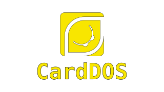

# **CardDOS**  
*A DOS-Like OS for the ESP32-S3 Cardputer*  

<p align="center">
  
</p>

## **📌 Overview**  
**CardDOS** is a minimalist DOS-like operating system for the **ESP32-S3 Cardputer**, blending retro simplicity with modern hardware:  
- 🚀 **Xtensa-optimized syscalls** (no x86 emulation overhead).  
- ⌨️ **Interactive shell** (`CARDOM.COM`).  
- 📁 **FAT32 filesystem** (microSD support).  
- 🎮 **Assembly/C programs** (`.COM` binaries).  

---

## **✨ Features**  
| **Component**       | **Status** | **Details**                          |
|---------------------|------------|--------------------------------------|
| **Kernel**          | ✅         | Cooperative multitasking, syscalls   |
| **Display Driver**  | ✅         | ST7789 (SPI, 135x240 RGB565)        |
| **Keyboard Driver** | ✅         | GPIO matrix decoding                 |
| **FAT32 Support**   | ⚠️         | Read-only (WIP: write support)       |
| **Shell**           | 🚧         | Basic `CARDOM.COM` (in progress)     |

---

## **📂 Project Structure**  
```plaintext
carddos/
├── firmware/          # Kernel and bootloader
│   ├── boot.S         # Bootloader (Xtensa ASM)
│   └── kernel.c       # Syscall handlers
|   └── syscalls.S     # Syscall functions
├── drivers/           # Hardware drivers
│   ├── display/       # ST7789 (SPI+DMA)
│   └── keyboard/      # GPIO matrix
├── programs/          # User programs (.COM)
|   └── HELLO.S        # Hello World program
├── examples/          # Sample code
└── docs/              # Pinouts, syscall docs
```

---

## **⚡ Quick Start**  
### **1. Prerequisites**  
- **Toolchain**: ESP-IDF v5.0+ or Xtensa GCC.  
- **Hardware**: ESP32-S3 Cardputer + FAT32-formatted microSD.  

### **2. Build & Flash**  
```bash
cd firmware/kernel
make all flash  # Builds and flashes the kernel
```

### **3. Run a Program**  
Copy `.COM` files to the microSD (e.g., `HELLO.COM`), and the kernel will autoload them.  

---

## **📜 Syscall Reference**  
| **Syscall**  | **Usage (Assembly)**               | **Description**               |
|--------------|-----------------------------------|-------------------------------|
| `0x09`       | `movi a2, 0x09; movi a3, msg; syscall` | Print string (`a3` = pointer) |
| `0x3F`       | `movi a2, 0x3F; syscall`          | Read key (returns in `a3`)    |
| `0x4C`       | `movi a2, 0x4C; syscall`          | Exit program                  |

---

## **📝 Example: HELLO.COM**  
```assembly
; hello.S
.global _start
_start:
    movi a2, 0x09       ; SYS_PRINT
    movi a3, msg        ; String pointer
    syscall
    movi a2, 0x4C       ; SYS_EXIT
    syscall
msg: .string "Hello, CardDOS!"
```

Compile with:  
```bash
xtensa-esp32s3-elf-gcc -nostdlib -Wl,--oformat=binary hello.S -o HELLO.COM
```

---

## **🛠️ Hardware Support**  
| **Peripheral**  | **Details**                          |
|-----------------|--------------------------------------|
| **Display**     | ST7789 (SPI, 135x240, 16-bit color) |
| **Keyboard**    | 8x8 GPIO matrix (56 keys)           |
| **Storage**     | microSD (FAT32, SPI)                |
| **Debug**       | UART over USB-C (115200 baud)       |

---

## **🚧 Roadmap**  
- **v0.1**: Basic shell (`CARDOM.COM`).  
- **v0.2**: File I/O (read/write).  
- **v0.3**: Wi-Fi stack (HTTP, NTP).  

---

## **🤝 Contributing**  
1. Fork the repo.  
2. Create a branch (`git checkout -b feature/your-idea`).  
3. Submit a **Pull Request**.  

See [CONTRIBUTING.md](CONTRIBUTING.md) for guidelines.  

---

## **📜 License**  
MIT License. See [LICENSE](LICENSE).  

---

**🌟 Let’s build something awesome!**  
🔗 [github.com/souzamonteiro/carddos](https://github.com/souzamonteiro/carddos)  
