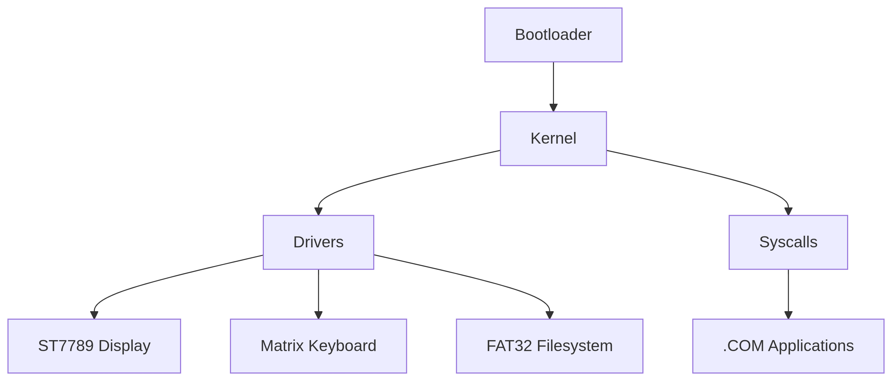

# **CardDOS Technical Documentation**

## **1. Project Overview**
**CardDOS** is a DOS-like operating system developed for the **ESP32-S3 Cardputer**, combining the simplicity of MS-DOS with modern hardware capabilities. The project aims to create a lightweight, efficient environment compatible with Assembly and C programs.

---

## **2. System Architecture**

### **2.1. High-Level Diagram**


### **2.2. Core Components**
| **Component**       | **Description**                                                                 |
|----------------------|---------------------------------------------------------------------------------|
| **Bootloader**       | Loads the kernel and shell from flash to RAM.                                   |
| **Kernel**           | Manages tasks, syscalls, and drivers.                                           |
| **Drivers**          | Control hardware (display, keyboard, microSD).                                  |
| **Syscalls**         | Interface between applications and kernel (e.g., `SYS_PRINT`, `SYS_READ`).      |
| **Shell**            | Command interpreter (`SHELL.COM`).                                             |

---

## **3. ESP32-S3 Cardputer Hardware**

### **3.1. Specifications**
| **Component**       | **Details**                                                                     |
|----------------------|---------------------------------------------------------------------------------|
| **CPU**              | Xtensa LX7 (dual-core, 240 MHz)                                                |
| **RAM**              | 512KB SRAM + 320KB ROM                                                         |
| **Flash**            | 8MB (expandable via microSD)                                                   |
| **Display**          | ST7789 (135x240 pixels, SPI, RGB565)                                           |
| **Keyboard**         | 8x8 matrix (56 keys)                                                           |
| **Storage**          | microSD slot (FAT32)                                                           |

### **3.2. Critical Pinout**
| **Peripheral**       | **ESP32-S3 Pin** | **Protocol** |
|----------------------|------------------|--------------|
| Display (SCLK)       | GPIO 12          | SPI          |
| Keyboard (Row 1)     | GPIO 2           | GPIO         |
| microSD (CS)         | GPIO 10          | SPI          |

---

## **4. Kernel Architecture**

### **4.1. Boot Process**
1. **Bootloader**:  
   - Loads `kernel.bin` from flash to `0x3FFC0000`.  
   - Initializes basic hardware (SPI, GPIO).  
2. **Kernel**:  
   - Configures syscalls and drivers.  
   - Executes `SHELL.COM`.

### **4.2. Syscalls (System Calls)**
| **Syscall** | **Assembly**                          | **Description**                     |
|-------------|---------------------------------------|-------------------------------------|
| `0x09`      | `movi a2, 0x09; movi a3, msg; syscall` | Prints string to display.           |
| `0x3F`      | `movi a2, 0x3F; syscall`             | Reads key from keyboard.            |

### **4.3. Memory Management**
- **Static Allocation**:  
  - Kernel: `0x3FFB0000`–`0x3FFBFFFF` (64KB).  
  - Applications: `0x3FFC0000`–`0x3FFDFFFF` (128KB).  

---

## **5. Application Architecture**

### **5.1. .COM Format**
- **Header**: None (raw binary).  
- **Entry Point**: `_start` (defined in Assembly).  
- **Max Size**: 32KB (due to RAM constraints).

### **5.2. Assembly Example**
```assembly
; HELLO.COM
.global _start
_start:
    movi a2, 0x09       ; Syscall: PRINT
    movi a3, msg        ; String pointer
    syscall
    movi a2, 0x4C       ; Syscall: EXIT
    syscall
msg: .string "Hello, CardDOS!"
```

### **5.3. Compilation**
```bash
xtensa-esp32s3-elf-gcc -nostdlib -Wl,--oformat=binary hello.S -o HELLO.COM
```

---

## **6. Tools and Languages**
| **Tool**              | **Purpose**                                  |
|-----------------------|---------------------------------------------|
| **ESP-IDF v5.0+**     | Official ESP32-S3 toolchain.                |
| **Xtensa GCC**        | Assembly/C code compilation.                |
| **FFmpeg**            | Image conversion to RGB565.                 |
| **Git**               | Version control.                            |

---

## **7. Detailed Roadmap**
### **Phase 1: Core Functionality (v0.1)**
- [ ] Functional bootloader.  
- [ ] Display driver.  
- [ ] Shell (`CARDOM.COM`).  

### **Phase 2: Extensions (v0.2)**
- [ ] microSD write support.  
- [ ] File API (`fopen()`, `fread()`).  

### **Phase 3: Networking (v0.3)**
- [ ] Wi-Fi stack (HTTP/NTP).  

---

## **8. Challenges and Solutions**
| **Challenge**         | **Solution**                              |
|-----------------------|------------------------------------------|
| **Limited RAM**       | Static allocation + overlays.            |
| **No MMU**            | Manual pointer validation.               |
| **SPI Latency**       | DMA for transfers.                       |

---

## **9. References**
- [ESP32-S3 Datasheet](https://www.espressif.com/sites/default/files/documentation/esp32-s3_datasheet_en.pdf).  
- [ST7789 Manual](https://www.rhydolabz.com/documents/33/ST7789.pdf).  

---

**🔗 Repository**: [github.com/souzamonteiro/carddos](https://github.com/souzamonteiro/carddos)  
**📝 License**: Apache 2.0.  

*(Documentation last updated: October 2023. Continuous technical review.)*  

